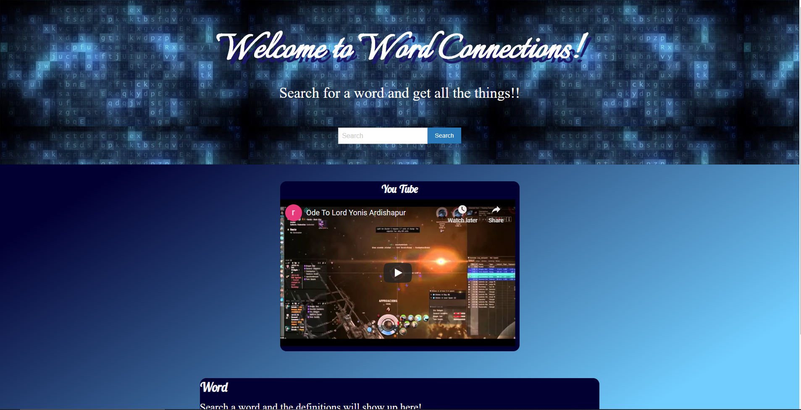
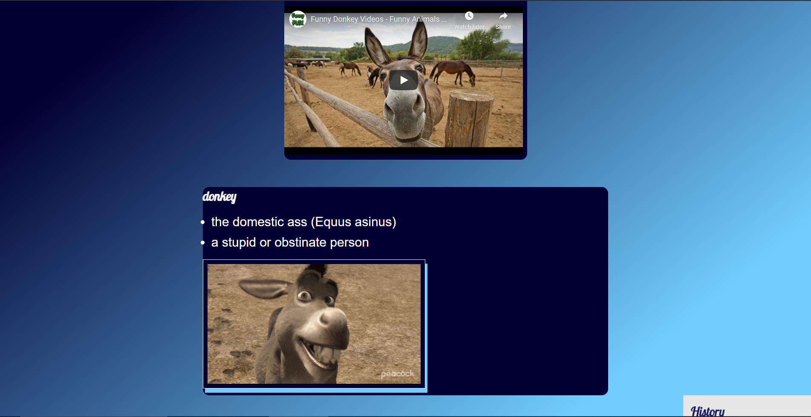
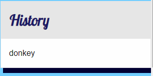

# Word Connections
### `a Positive Affirmations creation`

## *Objective* 
# Our goal was to craete a websiite that meets the criteria of the following user story.

`AS A person who doesn’t know this word`
*I WANT to be able to easily search in one spot and find tons of cool stuff about the word*
*SO THAT I now know how to use the word*

### Method
We started by planning on a white board the layout of the website and what we wanted it to do 
We then decided on the tools we would use ( css framework/api's). Next our team created a kanban board and defined the tasks we had to work 

 
 
 

### Usage 
to make word definition and usage connections.

### Instalation
To make the project work you will need -
* an editor or ide that will save file in the proper types *(html,css,javascript)*  
`Visual Studio or Visual Studio Code` will work great.
* using a version control system you can fork and clone my repo, you could also 
just download the files directly for git hub.

### Deployed website and screenshots

[Link](https://phillipmerriman.github.io/Group-Project-1/)

### Credits
* Trillogy Education
* White Board app [Link](https://awwapp.com/)
* Github [Link](https://github.com/)
* Gify-api [Link](https://developers.giphy.com/)
* Webster Merriam [Link](https://dictionaryapi.com/)
* YouTube Api [Link](https://developers.google.com/youtube/v3)

### Contributing
Pull requests are welcome. For major changes, 
please open an issue first to discuss what you would like to change. 
 Please make sure to update tests as appropriate.

### License

    
    © 2020 Trilogy Education Services, a 2U, Inc. brand. All Rights Reserved.

   